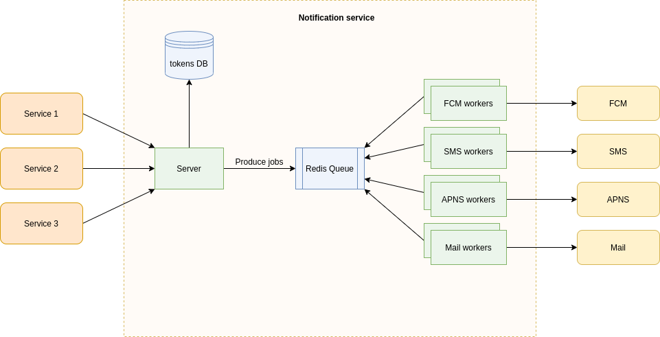

# Notification service
A service that expose an api and handle notifications sending to services providers, it use [Bull](https://github.com/OptimalBits/bull) redis based queue to handle notification requests and rate limit them when needed.
The service was a designed to scale, so server, redis, db, and workers can each scale horizontally.



## API
`POST /notification` - Add notification to be served

`GET /docs` - Swagger docs for the api

`GET /queues` - Queues visualization dashboard


## Get started

Build and run containers
```
$ npm run docker-build
```
Enter bash of node container
```
$ npm run docker-start
```
Start services
```
$ npm start
```
Run test cases
```
$ npm test
```
